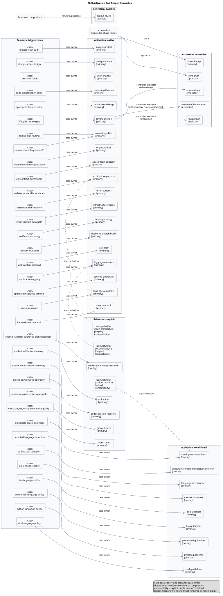
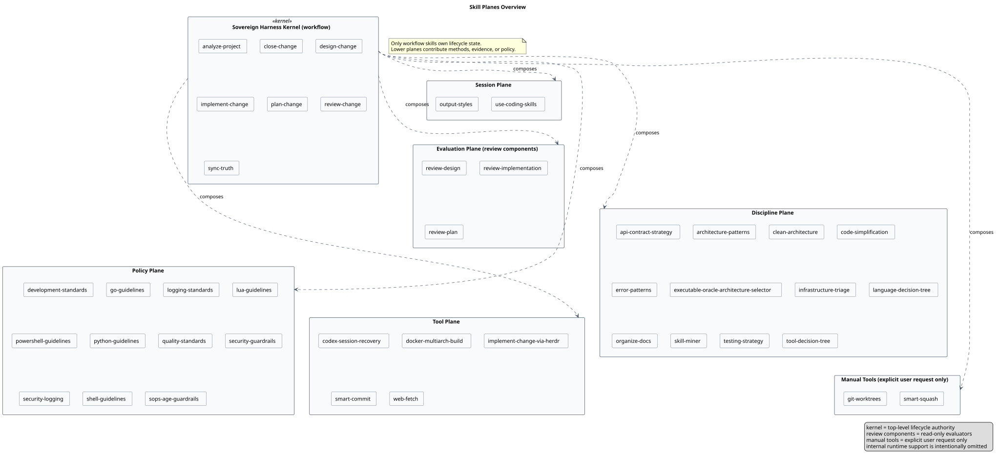

# Development Skills

Claude Code and Codex plugins plus a portable public skill payload organized around a sovereign harness kernel, with supporting truth, evaluation, policy, and tooling planes underneath it.

New here? See `docs/quickstart.md` for install verification and a first end-to-end change walkthrough.

For AI-facing repository rules and the docs truth boundary, see `AGENTS.md`.

## Source And Install Surfaces

- `src/skills/` is the nested authored skill tree.
- `skills/` is the generated root-flat 39-skill payload consumed by both maintained plugin manifests and standalone skill installers.
- `contracts/skills.toml` is the source-of-truth source mapping, exposure, activation-mode, default-role, runtime ownership, and provider-projection contract keyed by public skill ID.
- `contracts/runtime-bundles.toml` declares the exact production Python files and normalized canonical contract projections copied into runtime-owning generated skills.
- `skills/use-coding-skills/references/routing.toml` is the semantic trigger-case, discovery, phase-owner, review-evaluator, support-route, composition, and host-wrapper contract.
- `src/runtime/harness/` is the single authored non-discoverable deterministic lifecycle runtime; six generated lifecycle skills carry it under `scripts/harness/`.
- `.dist/` is ignored inert local output and is never generated or validated by this repository.
- `skills.index.json` is generated from `contracts/skills.toml`.

Regenerate and validate with:

```bash
python3 scripts/generate-skills-index.py
python3 scripts/flatten-skills.py --target root-flat
python3 scripts/generate-workflow-diagrams.py
bash scripts/check.sh
```

`scripts/check.sh` is a strict serial checker: generated root-flat parity, standalone closure, contracts, index, diagrams, Ruff, ty, pytest, and Markdown each run once. It leaves ignored `.dist/` untouched.

The deterministic harness requires GNU/Homebrew Bash 4 or newer. On macOS, ensure Homebrew `bash` and GNU coreutils (`realpath --relative-to`) precede system tools on `PATH`.

## Sovereign Harness Kernel

The top-level harness authority for this repository is:

- `analyze-project`: Read-only project-state and truth query entry.
- `design-change`: Top-level change-design entry for scope, truth impact, boundary impact, and conditional economics-aware selection for material persisted architecture boundaries.
- `plan-change`: Top-level planning entry for a versioned task DAG, dependencies, named conditional-parallel batches, delegation eligibility, portable execution and reasoning profiles, verification, explicit failure policy, conditional persisted implementation-language decisions, and reversible staging of approved architecture decisions.
- `implement-change`: Top-level execution controller with approved-plan validation, one-plan execution-unit semantics, serial-first or explicitly approved conditional-parallel implementation, runtime actor and profile binding, controller-owned convergence and repair, one-time worktree preflight, and deterministic fallback/review/verify/recovery outcomes.
- `review-change`: Top-level agent-native review gate that builds a bounded brief, prefers subagent review when useful, adjudicates candidate findings, and returns one harness verdict.
- `sync-truth`: Top-level truth-sync gate for stable truth updates with verified evidence.
- `close-change`: Top-level close gate for merge, release, or cleanup judgment.

Kernel defaults:
- serial-first execution unless an approved plan defines a dependency-frozen named batch with safe isolation, disjoint writes and resource locks, a bounded width, and explicit human approval
- portable semantic routing by default; an `inherit-main` override changes model and reasoning binding only, never the approved task topology or serial/parallel shape
- human-sovereign approvals at design, plan, truth-sync, and close
- no unattended execution by default
- `design-change` and `plan-change` require artifact validation plus mandatory review before the human gate
- artifact handoff is gated by explicit `approval_status`, not by prose reminders alone
- when a gate already determines the next state, the harness reports that state instead of asking whether to continue

`src/runtime/harness/cli.py` owns contract-derived request classification and next-phase routing, design and plan validation, immutable plan compilation, ledger state and evidence operations, binding envelopes, truth-sync evaluation, and close evaluation. `contracts/lifecycle.toml`, `contracts/workflow-modes.toml`, and the installed routing contract remain the authored lifecycle owners; generation normalizes their minimum runtime projection into each skill-local bundle instead of maintaining a second Python rule table.

All newly authored artifacts and newly initialized ledgers use version 4. Version-4 compilation binds truth impact, truth-sync scope, complete task metadata, named parallel batches, and runtime policy before ledger initialization; the ledger alone admits ready serial or batch work and supplies immutable admission provenance to binding. Version-3 artifacts and ledgers remain readable only for immutable evidence, digest verification, and truth-sync or close evaluation for work already converged before the runtime refresh. The refreshed runtime rejects version-3 initialization, task mutation, verification, review, repair, external evidence, admission, and binding.

Ledger persistence fails closed. A confirmed durable restoration returns `ledger-write-failed`; an outcome where neither promoted nor restored authority can be proven returns `ledger-durability-unknown`, forbids blind retry, and requires stop-and-diagnose.

Lower-plane skills stay available as components the kernel can call, not as competing top-level authorities.

Runtime binding defaults to codex-native (`schema_version: 2`), which binds delegated roles through user-owned, untracked Codex Multi-Agent role files with pre-emission capability validation and typed stops. `implement-change-via-herdr` remains an explicit Tool-plane overlay with its byte-compatible `schema_version: 1` adapter contract. Both compose `implement-change`, which remains the sole lifecycle controller and final judge; plans keep provider-neutral task profiles and cannot change topology, authority, or oracles through runtime routing.

External-file capability and consumption use separate approvals. A repository-only E1 bootstrap installs and verifies the optional broker without touching an external target; only a later independently reviewed and approved E2 plan may declare exact existing external files. Repository-only version-4 plans declare an empty external set. Any request for file creation, deletion, glob or directory authority, generic editing, caller-selected rename, metadata change, delegated or parallel external writes, automatic rollback, or non-metadata evidence requires a new design or plan boundary rather than an implicit upgrade.

## Optional Session Routing And Style

- `use-coding-skills`: Optional router for ambiguous multi-stage coding work, session boundaries, and compact handoffs. Its installed routing contract owns semantic case boundaries, phase-to-workflow mapping, and support routes; direct workflow and policy matches bypass it.
- `output-styles`: Agent-agnostic response modes plus the composition rule that one primary skill owns domain order while other matched skills contribute semantic overlays instead of competing report templates.

## Activation And Trigger Ownership

Each public skill declares one activation mode and one default role in `contracts/skills.toml`. The installed routing contract assigns every semantic trigger case exactly one owner and records positive and negative examples; optional overlays contribute policy or technique without becoming another primary owner. Lexical hints are examples for inspection, not keyword routing rules.

| Activation mode | Intended use | Generated Codex policy |
|---|---|---:|
| `native` | Direct semantic owner | implicit allowed |
| `conditional` | Predicate-matched overlay or focused owner | implicit allowed |
| `controller` | Reached through lifecycle or review control | implicit disabled |
| `explicit` | Explicit selection | implicit disabled |
| `baseline` | Shared rendering composition | implicit allowed |

Codex invocation policy is generated from this table into flat install surfaces; it is not authored independently per skill. Claude's shared payload remains provider-compatible and reports effective `default-visible` state rather than claiming an unsupported per-skill visibility switch.



The three retired compatibility aliases are absent. Their durable owners are `architecture-patterns`, `development-standards`, and `logging-standards`.

## Distribution

- Claude Code uses the maintained local marketplace and plugin path exposed by `.claude-plugin/` and `install.sh`.
- Codex uses the maintained local marketplace and plugin path exposed by `.codex-plugin/`, `.codex-marketplace/`, and `install-codex.sh`.
- Other coding agents may optionally use `npx skills@latest add CsHeng/agent-skills`; every selected runtime-owning skill includes its executable bundle, while destination and installation lifecycle remain advisory and consumer-managed.

The `npx skills` path is guidance, not a repository-owned installer contract. This repository does not restrict selected agents, scopes, destinations, or copy/symlink modes; it does not inspect duplicate exposure or promise that independently installed copies coexist. Selection, installation, updates, removal, cleanup, and any coexistence issues belong to the consumer and the upstream CLI. The retained 39 public names remain stable; `clean-architecture`, `quality-standards`, and `security-logging` are retired.

## Skill Planes

Lower-plane skills stay available as components the kernel can call, not as competing top-level authorities. Only workflow skills own lifecycle state; every other plane contributes methods, evidence, or policy.



| Plane | Role | Examples |
|---|---|---|
| Session | Optional routing, session boundaries, response style | `use-coding-skills`, `output-styles` |
| Evaluation | Read-only review evaluators coordinated by `review-change` | `review-design`, `review-plan`, `review-implementation` |
| Discipline | Reusable engineering methods and decision trees | `architecture-patterns`, `testing-strategy`, `language-decision-tree`, `tool-decision-tree`, `skill-miner` |
| Policy | Language, security, quality, and logging rules | `python-guidelines`, `go-guidelines`, `shell-guidelines`, `security-guardrails`, `sops-age-guardrails`, `development-standards` |
| Tool | Narrow tool adapters and operational helpers | `implement-change-via-herdr`, `web-fetch`, `docker-multiarch-build`, `codex-session-recovery`, `smart-commit` |
| Manual tools | Explicit user request only, never implicit | `git-worktrees`, `smart-squash` |

The authoritative inventory with roles, permissions, source mappings, runtime ownership, and semantic requirements is `contracts/skills.toml`; the rendered map above is generated from it by `scripts/generate-workflow-diagrams.py`. `src/runtime/harness/` is authored and non-discoverable. Each generated `skills/<id>/SKILL.md` is the public deep-dive entry for that skill.

## Docs

- Human-facing docs stay here in `README.md`.
- AI-facing rules and the repository docs truth boundary live in `AGENTS.md`.
- Docs directory search guidance and history notes live in `docs/README.md`.
- Stage artifacts live under `docs/plans/` and are excluded from default docs search by `docs/.ignore`.
- Architecture and maintenance contracts live under `docs/architecture/`.
- The canonical workflow maintenance view is `docs/architecture/workflow-orchestration.md`; rendered SVG views live under `docs/architecture/generated/` for direct human viewing, with generated PlantUML sources under `docs/architecture/diagrams/`.

## Review Defaults

Review is agent-native. The main coding agent prefers one reviewer subagent for non-trivial bounded work and may review a small mechanical change directly. Skills describe roles and evidence contracts without choosing a reviewer tool. A delegated reviewer cannot delegate recursively.

Default review depth:
- `review-design`: `boundary`, focused on architecture boundaries and downstream implementation surface
- `review-plan`: `boundary`, focused on executable DAG, dependencies, oracle, ownership, recovery policy, and readiness
- `review-implementation`: bounded to the approved task diff, task tests, declared oracles, touch set, and justified direct dependencies

Repair behavior:
- reviewers return candidate findings only
- the main agent accepts, rejects, defers, or escalates each material candidate
- only accepted findings with qualifying change causality and an approved-contract violation enter controller-owned repair
- implementation repair normally uses one initial bounded review and one focused verification review, with at most one additional same-slice repair attempt

## Design Principles

- Keep skills thin and operational: purpose, scope, deterministic steps, and a short checklist.
- Avoid long tutorial content inside skills; keep examples minimal.
- Prefer cross-skill references over duplication; architecture layers and clean boundaries belong to `architecture-patterns`.
- Prefer bounded readonly review context and narrow repair fences for plan-bound execution work.
- Keep decision discovery, work-package readiness, and bounded review inside the sovereign harness instead of restoring third-party workflow control.

## Install

Claude Code marketplace registration:

```bash
./install.sh
```

Project scope (writes to `$CLAUDE_PROJECT_DIR/.claude/settings.json` when available):

```bash
./install.sh --scope project
```

Local scope (writes to `$CLAUDE_PROJECT_DIR/.claude/settings.local.json` when available):

```bash
./install.sh --scope local
```

Codex local marketplace registration and plugin install:

```bash
./install-codex.sh
```

For other coding agents, the optional advisory path is:

```bash
npx skills@latest add CsHeng/agent-skills
```

Review the upstream CLI's proposed targets and locations before accepting them. The repository neither constrains nor verifies that choice and does not manage coexistence with either provider plugin.

For deterministic lifecycle entry, a host-level `AGENTS.md` may keep user preferences, runtime constraints, and thin public-skill hints such as ambiguous multi-stage work -> `coding:use-coding-skills`. The installed `use-coding-skills/references/routing.toml` and `implement-change/references/workflow.toml` remain the route and runtime DAG authorities; do not copy their graphs, budgets, or exits into the host bootstrap.

Manual Codex flow:

```bash
codex plugin marketplace add "$(pwd)/.codex-marketplace"
codex plugin add coding@csheng
```

Codex manifest validation:

```bash
uvx --with pyyaml python "$HOME/.codex/skills/.system/plugin-creator/scripts/validate_plugin.py" .
```

### Verify

```bash
claude plugin list
```

Expect `coding@csheng` with `Status: enabled`. **Restart Claude Code after install or update** to apply changes; skills are loaded at session start.

### Update After Local Changes

This marketplace installs from the local directory; Claude does not fetch a remote package. After pulling or editing this repository:

```bash
claude plugin marketplace update csheng
claude plugin update coding@csheng
```

Then restart Claude Code. During pre-release development, uninstall/reinstall also works without a version bump:

```bash
claude plugin uninstall coding@csheng
claude plugin install coding@csheng
```

Codex update when the plugin install surface is in use:

```bash
uvx --with pyyaml python "$HOME/.codex/skills/.system/plugin-creator/scripts/update_plugin_cachebuster.py" .
codex plugin add coding@csheng
```

Start a new Codex thread to pick up refreshed plugin skills and metadata. Consumer-managed `npx skills` installations follow the upstream CLI's own update and removal workflow.

## References And Acknowledgements

The portable payload follows the [Agent Skills](https://agentskills.io/) directory model. [mattpocock/skills](https://github.com/mattpocock/skills) and the [`skills` CLI](https://github.com/vercel-labs/skills) informed the portability and bundled-resource approach, while the maintained Codex lane follows [Codex Skills](https://developers.openai.com/codex/skills/).

Early versions of this harness drew substantial inspiration from [Superpowers](https://github.com/obra/superpowers), especially its provider-native plugin approach and reusable cross-agent skill techniques. The contracts and lifecycle rules in this repository are the authority for current behavior.

The long-horizon maintenance guidance also learned from the [DeepSeek Harness skill collection](https://github.com/deepseek-ai/deepseek-harness/tree/master/.agents/skills) and the [reclaim-code-entropy adaptation](https://github.com/Yevanchen/reclaim-code-entropy/blob/main/skills/reclaim-code-entropy/SKILL.md), especially around decision-record lifecycle, evidence-first simplification, and durable current-context prose. The implementation here was written independently for this repository: local contracts remain authoritative, and no external skill file is copied into the runtime payload.
