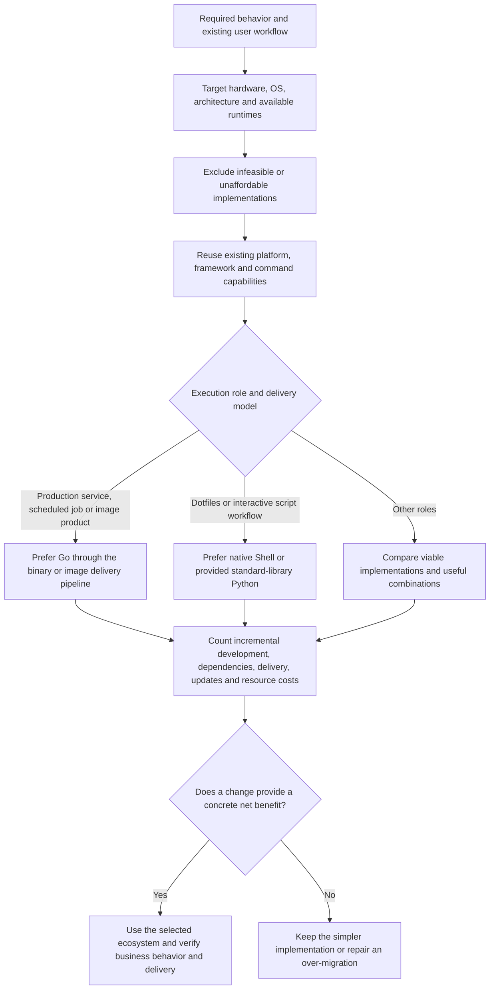

# Language Selection

## Decision Unit And Order

Choose an implementation for the complete user-facing capability: its behavior, entrypoint, dependencies, development loop, delivery, updates, verification, and resource use. Shorter local code, a preferred language, or an existing migration plan does not establish a simpler tool.

Use this decision order for new persisted code and authorized migrations. It is reasoning guidance, not a required workflow, scoring system, or approval gate.

## Establish Target Capabilities First

Determine where the code actually runs, whether that target supports scripts or binaries, its OS/ABI and CPU architecture, available RAM and flash/storage, installed interpreters and native commands, and how code reaches it. Do not infer these capabilities from the controller or development machine. An architecture label alone does not establish an OS, runtime, or resource budget.

An explicitly constrained runtime is a hard boundary: retain required BusyBox ash, POSIX `sh`, device scripting, or other native technology. Distinguish ash, Bash and Zsh and their available commands rather than treating every shell as interchangeable. An incidental base image or available shell does not itself prohibit another implementation.

On constrained targets, count the delivered binary or interpreter, libraries, assets, installer and runtime storage against the actual budget. Do not install Python or an environment manager merely to enable glue. Selecting Go still requires a supported target and an affordable artifact; compiled delivery is not evidence of fit by itself.

Existing repository architecture and runtime contracts apply within the user's current authorized objective. A reassessment may correct model-derived language assignments and deployment mechanisms; preserve actual hardware, behavior and safety requirements rather than treating the old plan as proof of their necessity.

## Choose By Business Role And Incremental Burden

First reuse an existing platform capability, framework module or native command that already owns the work. A helper invoked by a framework is not automatically part of that framework's required language ecosystem.

For dotfiles, interactive helpers, hooks and similar script-oriented tools, prefer Shell, an already-provided Python interpreter using only its standard library, or a simple combination of the two when they satisfy the behavior clearly and reliably. Choose between them by the actual logic and available commands. The normal edit, sync and invocation workflow is part of their value; Go must offer enough benefit to justify compilation and delivery. Do not turn this contextual preference into a language ranking for every service or target.

Use Shell for native command composition, pipelines, bootstrap, environment discovery, parent-shell effects and script-oriented work that remains clear with available tools. Length, branching, JSON, HTTP or a small amount of state does not independently justify a Go implementation. Conversely, do not build a fragile parser in Shell merely to avoid a suitable higher-level implementation.

Use standard-library Python for bounded script logic when the compatible interpreter is already provided on the actual execution target. It may be a named script or embedded in Shell; neither shape makes an absent interpreter available. Do not create a package environment or add third-party dependencies for this role.

Prefer Go for maintained production services, scheduled jobs and self-owned business logic shipped in an image or binary, subject to the target capabilities and required ecosystem integration. An existing build and artifact delivery pipeline usually makes compilation a normal product cost; do not apply the dotfiles edit-and-sync preference to that runtime. Count incremental dependencies and delivery work instead of treating all compilation as a new burden. Short-lived jobs can share this production preference; code length or lack of concurrency does not make them interactive scripts.

For other maintained domain tools, Go's runtime, reuse and delivery advantages must fit the actual role. Reusable parsing and state logic can support that choice, but JSON, HTTP or state alone does not. Calling native tools from Go is appropriate when those tools own a required capability; ordinary orchestration or startup Shell can remain when useful. Production Go need not reimplement native system tools or every entrypoint in Go.

Select third-party Python only when a specific library or framework is the right match for the required business capability and that capability or integration is available only through Python. Identify the capability and why the viable Shell/Go choices cannot supply it. Library familiarity, an available SDK, or routine HTTP, JSON or YAML processing is not sufficient. Otherwise prefer Go over creating and maintaining a Python package environment, after considering whether existing native tools already suffice. This preference concerns the environment and delivery burden and does not require a speed benchmark.

Preserve required Python framework execution under its established contract. Ansible's generated modules and Python-only framework integration are framework capabilities, not this project's Python product to replace. Their interpreter or dependencies do not independently justify adding another Python application. uv, venv and pyenv manage environment costs; they do not remove interpreter compatibility, installation, updates, isolation, image size or storage obligations.

Use Lua for an existing Lua implementation or configuration ecosystem. Do not introduce it as general-purpose automation when another established project language owns that boundary. Other constrained targets follow their actual native technology rather than being forced into the Shell/Python/Go candidates.

## Keep Combined Implementations One Usable Tool

Shell plus standard-library Python and Shell plus a delivered binary are useful combinations when each part reduces the complete implementation's burden. Shell may own the stable user entrypoint, locate its co-delivered implementation, pass inputs, or retain native orchestration and parent-shell effects. Preserving that entrypoint can be useful even when Shell owns no business logic. Keep domain rules in one implementation rather than duplicating them across the boundary.

For a tool expected to work after its normal copy, sync or install operation, deliver and update the entrypoint and its implementation together. Do not leave the user to assemble a helper, locate another checkout, repair PATH or reconcile separately updated versions merely because the implementation language changed. Self-contained delivery means usable under its declared system prerequisites, not necessarily one file or zero dependencies. A binary can satisfy it when the existing delivery mechanism actually carries the correct artifact and required assets.

Count development-to-deployment differences, compilation, platform builds, native commands, CGO/dynamic libraries, artifact size and updates. A binary may move dependencies to the build host but does not automatically remove all runtime dependencies. Do not add launchers, private build/cache lifecycles or a distribution framework to make an unnecessary language boundary cheaper. Reuse the existing entrypoint and delivery mechanism when they suffice.

The controller or CI owns compilation for managed execution targets; deliver the target-compatible binary or image with its required runtime assets. A host explicitly owning development/build work is a different execution role. One-shot remote work should reuse framework modules, native Shell or standard-library Python under an established interpreter contract before introducing another maintained product.

## Reassess Migrations Against The Original Outcome

For an authorized reassessment, start from the business capabilities actually changed, including original Shell and embedded scripts. Compare the earlier implementation, the current complete tool and the simplest viable correction. A remaining-Python inventory misses unnecessary Go implementations and costs introduced by the migration itself.

Separate a language decision from the quality of its implementation. When production or image delivery justifies Go, compare completing the current Go design, reusing suitable Go packages and replacing the flawed implementation before concluding that the language should change. Re-select parsing, serialization and other libraries for the business contract in the target ecosystem; do not reproduce the source language's general library behavior to preserve a literal translation. A suitable compiled dependency has its own build, update and runtime costs, not automatically the same interpreter/environment burden as a Python package.

Audit supporting machinery as well as top-level commands: migration-created file utilities, path handling, syntax analysis, coercion, transport and compatibility helpers can carry most of the unnecessary cost. Trace each suspect responsibility to its consumers and domain tests, then compare existing project capabilities, the target standard library and suitable mature packages before retaining custom code. Language-prefixed names and generic utility files are discovery clues, not verdicts; genuine source-language analysis or required protocol encoding may need a narrow adapter. Reduce the responsibility or replace its implementation rather than merely renaming the wrapper. A mature library owns general mechanics; the product still owns its business decisions and data protections.

Choose retention, a small repair, a replacement within the selected language, restoration of the simpler approach, or a useful combination by the user's outcome. Preserve later valid fixes and required data behavior when restoring an approach; do not blindly revert a historical batch. A migration-created wrapper, interface, compatibility layer or test is not automatically a permanent requirement. Explain the burden removed and introduced; preserving an already-written implementation is not itself a benefit.

Production and verification have separate execution environments. Changing production language does not require rewriting useful tests or fixture generators, and a controller-side test dependency is not automatically a target runtime dependency. Reassess what those tests assert: derive scenarios and expected results from business rules, actual consumers and retained data, rather than requiring identical results from the old language or library. Keep exact serialization, errors or bytes only where an actual protocol or consumer requires them. Fix environment or scratch placement directly when that solves the actual problem.

## Evidence And Acceptance

Explain material choices using target capabilities, business needs, the existing user workflow and total maintenance cost. Use proportionate evidence rather than a universal benchmark or mandatory report. When speed, memory, image size or storage decides the choice, compare representative complete executions and incremental dependencies, including relevant cold/warm behavior, build/runtime caches and artifacts. Code length alone is neither a benefit nor a defect.

Verify the actual entrypoint with the declared delivered files and prerequisites, from a representative working directory and environment. Check useful behavior, outputs and failure handling as well as how users obtain and update the tool. A backend unit test does not establish that the distributed entrypoint is usable. Local delivery simulation can establish this boundary without installing into the user's live environment.
