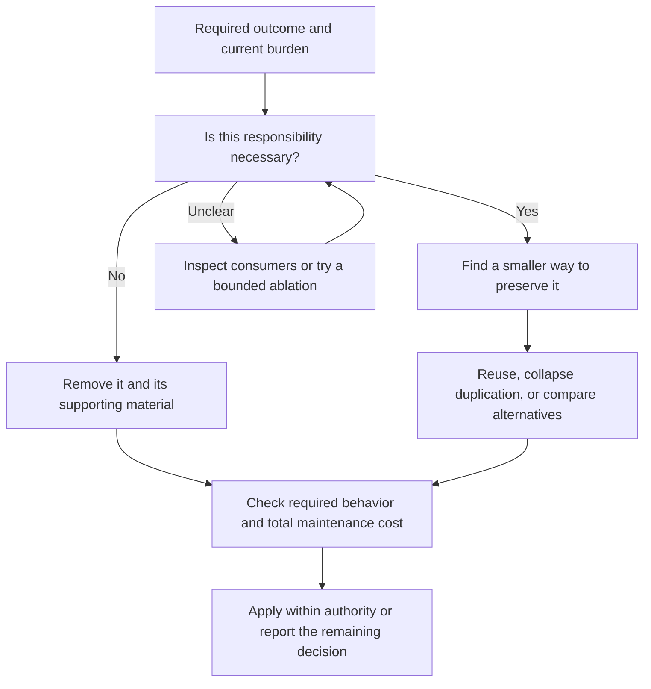

# Simplification

Use for unnecessary complexity, duplicated responsibilities, over-specified verification, or requested structural alternatives. Ordinary cleanup stays with the current task.

Reduce the total burden of delivering and maintaining the user's required outcome. Start with whether a responsibility is needed, then consider its implementation. Code, tests, fixtures, documents, diagrams, dependencies, and workflow machinery all count toward the cost. Apply YAGNI before DRY: removing an unnecessary mechanism is better than building a shared framework for it.

This is an assessment and routing entry, not a new lifecycle. An audit request remains read-only. When the user also asks to simplify and the change is sufficiently bounded, carry that authority into `implement-change`; do not stop at recommendations or manufacture a design/plan phase. Material unresolved product decisions use `design-change`. Review of only a supplied diff stays with `review-change`.

## Choose The Relevant Surface

Use only the relevant methods; this is not a sequence of compulsory skill invocations.

| Surface | Simplification question | Method when needed |
| --- | --- | --- |
| Code and configuration | Can a responsibility, layer, branch, compatibility path, or dependency disappear? | Current code and consumers; `development-standards` for necessity and reuse. |
| Tests and fixtures | What real behavior does each check protect, and is it already covered more clearly elsewhere? | `testing-strategy` for suite cuts, meaningful assertions, and shared fixtures. |
| Documents and diagrams | What does a reader still need to understand or decide? Can duplicated explanation or stale history be removed? | `organize-docs` for ownership, synchronization, and scoped retirement. |
| Architecture or bespoke framework | Would an existing capability reduce total ownership, including migration and adapters? | [Structural Alternatives](structural-alternatives.md) for a requested reassessment. |

## Establish What Must Remain

Read the current implementation, actual consumers, and relevant user requirements. Code and observed execution establish implemented behavior; documents and diagrams convey intent and explanation. Neither passing tests nor historical prose proves that every old mechanism is necessary.

Protect required outcomes, real public or persisted contracts, unique data, authorization, and current safety and recovery needs. Do not automatically protect every existing guard, audit field, parser quirk, provenance record, or compatibility branch. General plan approval and prior test coverage do not turn model-invented methods into user-fixed requirements. Conversely, search silence alone does not prove an external consumer is absent.

Ordinary consistency hashes and evidence bookkeeping follow the default in `development-standards`: do not add them without an explicit request or actual functional or trust need. When cleanup includes inherited mechanisms, assess that need again instead of grandfathering them through the word "contract".

## Make The Smaller Choice Concrete

- Bound the candidate to the requested surface and name what would disappear or replace it. Inspect authored owners before generated copies; keep mechanical projections with their source.
- Use consumer evidence to distinguish required semantics from incidental implementation details. Preserve values and outcomes where those matter; require exact bytes only where a real consumer or protocol needs them.
- Count replacement glue, tests, fixtures, dependencies, deployment, documentation, and maintenance. Fewer production lines alone do not establish a simpler system.
- For uncertain value, use a small reversible ablation: remove or bypass the candidate locally and observe representative required behavior. [Candidate Evidence](candidate-evidence.md) explains interpretation and limits. Obvious local cuts need no experiment ceremony.
- Synchronize affected explanations after the implementation changes. Prefer a diagram for relationships, flow, or state when it replaces confusing prose, and retain concise rationale and exceptions. Do not duplicate every diagram edge in paragraphs or test its wording.
- Retain history only when it has a current reference, operational, or decision value. When requested cleanup covers it, deletion is a valid alternative to moving and maintaining obsolete records. Keep real retention obligations; unrelated history remains outside scope.

## Return Or Continue

For an audit, lead with the strongest supported cuts, the requirement each preserves, the expected maintenance reduction, and any decisive uncertainty. Use concise prose, a comparison table, or a diagram as useful; do not require candidate IDs, evidence ledgers, or a field-filled record for every observation. A justified "keep" or "no useful cut" is a valid result.

For authorized application, continue through `implement-change` with the bounded changes and relevant checks. Do not claim an ablation proves untested consumers or failure modes, weaken required behavior to obtain a pass, or expand a local cleanup into an unsolicited rewrite. A genuine unresolved requirement calls for a narrow decision; routine implementation choices remain with the agent.
